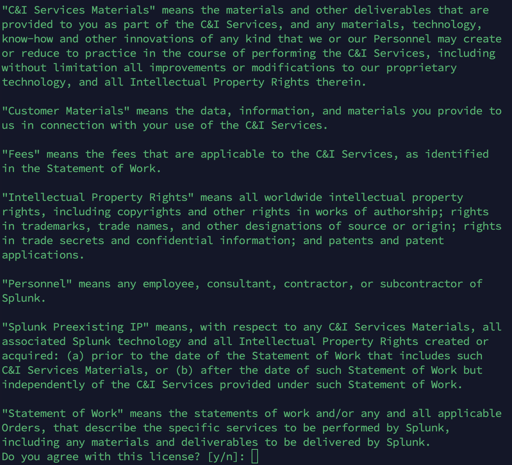
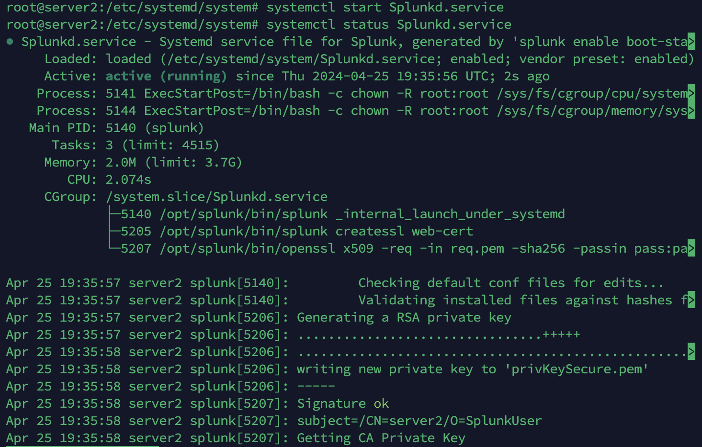

# Adding a new SSH key to your account
## hello

If you have an existing SSH key, you can use the key to authenticate Git operations over SSH.

# Generating a new SSH key and adding it to the ssh-agent
## mac
1- Open Terminal.
2- ssh-keygen -t ed25519 -C "rfarahany@gmail.com"

# Adding your SSH key to the ssh-agent
Start the ssh-agent in the background.

eval "$(ssh-agent -s)"

open ~/.ssh/config

If the file doesn't exist, create the file.

vim ~/.ssh/config

Open your ~/.ssh/config file, then modify the file to contain the following lines

Host github.com
  AddKeysToAgent yes
  UseKeychain yes
  IdentityFile ~/.ssh/id_ed25519 

ssh-add --apple-use-keychain ~/.ssh/id_ed25519

# Checking for existing SSH keys
ls -al ~/.ssh
### Lists the files in your .ssh directory, if they exist

id_ed25519.pub
id_ed25519

# Adding a new SSH key to your GitHub account

pbcopy < ~/.ssh/id_ed25519.pub

If pbcopy isn't working, you can locate the hidden .ssh folder, open the file in your favorite text editor, and copy it to your clipboard

Confirm access

Authentication keys

