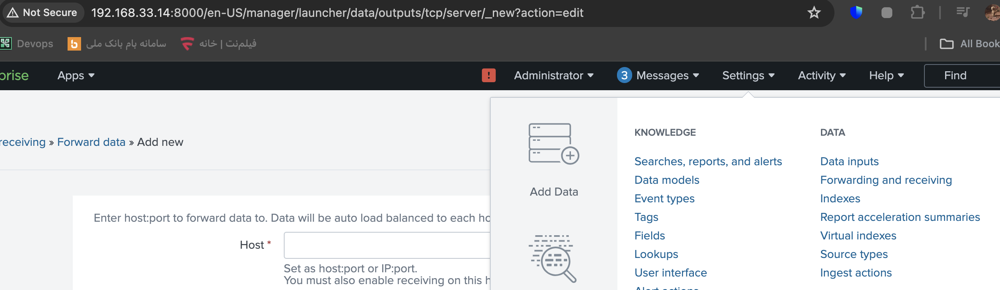

# install App
1- VMware
2- Vbox
3-Vcode
4- terminals (Putty on mac)

# Download

### ubuntu-server
1-https://ubuntu.com/
https://releases.ubuntu.com/22.04.3/ubuntu-22.04.3-live-server-amd64.iso 

> **Warning**
>
> Check box ssh in install 
> After Finish Install use this command to chek is ssh exist or not: ssh -ntlp

### ubuntu-Desktop
2- https://releases.ubuntu.com/22.04.3/ubuntu-22.04.3-desktop-amd64.iso

### VirtualBox
3- https://www.virtualbox.org/
https://download.virtualbox.org/virtualbox/7.0.14/VirtualBox-7.0.14-161095-OSX.dmg

### Rocky
4-https://rockylinux.org/
https://download.rockylinux.org/p

# Lunch OS
 ### VMware:

1-
2- Continue
3- upload Iso file from: 
[click on this link](#ubuntu-server)
4-Next....
> **Warning**
>
> Don't Forget 
>1-
>2-
>3-apt update

### V-Box
1- New
2- Chosoe Name
3- Select folder to save
4-Choose ISO
[click on this link](#ubuntu-desktop)
5-Check skip unattended Installation
6-Next....

#### Set SSH in V-Box
1- in Tools (up main page)

2- Network
3-Tab NAT Network
4-Create +
#### Set New Name 
5- SetName + check Enable DHCP

7-Power Off Mashin
8-in setting os (Main setting) > Network

9- Add Adapter 2
10-Check Enable
11-Attached to: Nat network
12- attach to [click on this link](#set-new-name)
13-ok
14- in Tools (up main page)
15 - Network - Adaptor 1

16- Advanced
17-Port Forwarding

18 - Set this Rule:

19-Go to Terminal (Putty)
20-IP:127.0.0.1 & Port:2222
21- Connect to server

# Add IP To linux
1- ip -br a
Find name of adaptor Down
lo               UNKNOWN        127.0.0.1/8 ::1/128 
enp0s3           UP             10.0.2.15/24 metric 100 fe80::a00:27ff:feba:d8f4/64 
enp0s8                        

                      
For me enp0s8   is free

2- nano /etc/netplan/00-installer-config.yaml
3- Add this text to add ip:
 
    enp0s8:
      addresses:
       - 172.16.0.5/24
  version: 2

# REmove Switch password
(reihane: username)
1- nano /etc/sudoers.d/reihane 
2- Add this text to file:
reihane ALL=(ALL) NOPASSWD:ALL

# show inside file
cat /etc/sudoers.d/reihane

# Install pakage
1-Jcal : dpkg -i url

**very very Important: switch user from root to your user**
7-code --version

If can visit same as below code Yor package install Successfull!!

reihane@srv1:~$ code --version
1.85.2
8b3775030ed1a69b13e4f4c628c612102e30a681
x64

# remove App
apt remove APPNAME

# Remove Dependency
apt autoremove (frequncy run this command to delete )

# Fun in  Linux
apt cmatrix then camtrix
apt sl then sl

# install specific version
apt install jcal=1.0.4 

# aptitude --help

first: sudo apt install aptitude
second: aptitude --help
pttiude download firefox
apt install -f

# install VScode on obunto Server (Task1)
1-sudo apt update
2-sudo apt install software-properties-common apt-transport-https wget -y
3-sudo apt install software-properties-common apt-transport-https wget -y
4-wget -q https://packages.microsoft.com/keys/microsoft.asc -O- | sudo apt-key add -
5-sudo add-apt-repository "deb [arch=amd64] https://packages.microsoft.com/repos/vscode stable main"
6-sudo apt install code

# Configuring a Static IP Address on Rocky Linux 9 whithout nmcli and nmtui (Task 2)
I do many tings but i write one of theme:

1- ip addr
2- ls /etc/NetworkManager/system-connections
3-touch /etc/NetworkManager/system-connections/enp0s3.nmconnection
4- uuidgen enp0s3 : generate UUID
3- nano /etc/NetworkManager/system-connections/enp0s3.nmconnection
copy all setting from ens160.nmconnection to enp0s3.nmconnection
use my UUID
But Doesn't not work!
:(

  https://www.golinuxcloud.com/set-static-ip-rocky-linux-examples/#Method-2_Configure_Static_IP_Address_using_ifconfig

  
# question
1- /var/cache/apt# ls not work
root@srv1:~# /var/cache/apt# ls
-bash: /var/cache/apt#: No such file or directory

2-root@srv1:~# apt-cache search
E: You must give at least one search pattern

