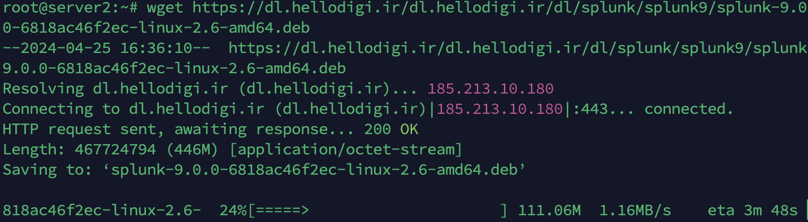
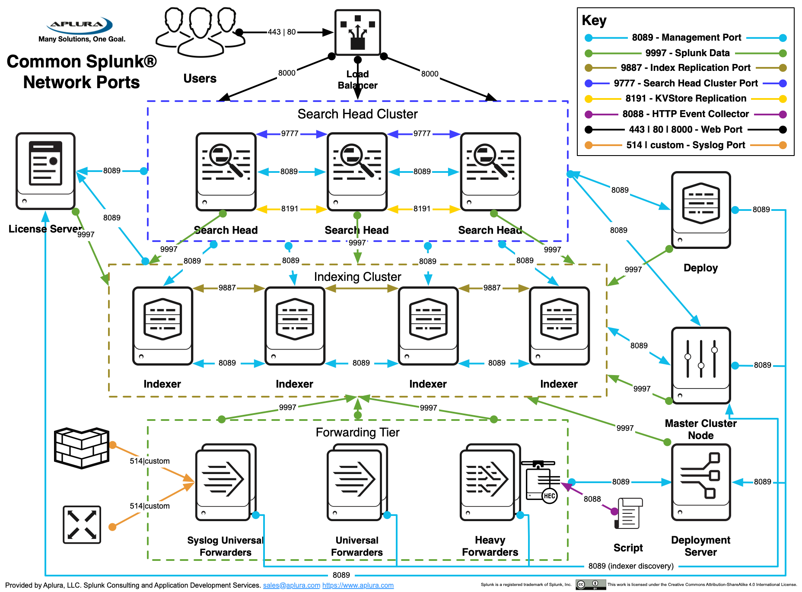
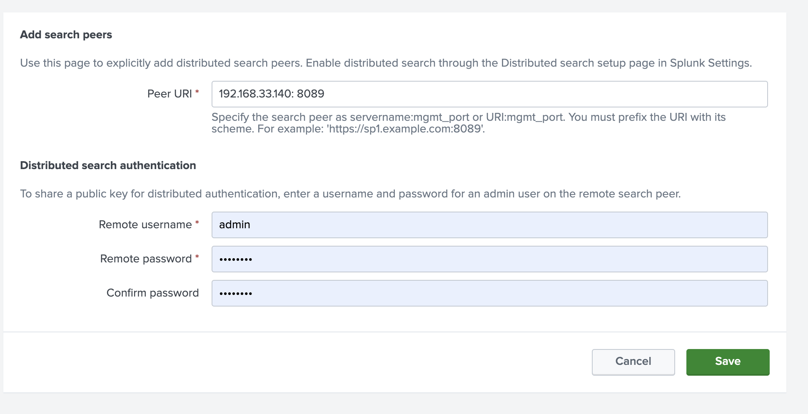

### Install Splunk

we have to set 3 servers:

server 1: indexer {192.168.33.13}
server 2: forwarder {192.168.33.14}

server 3: search head {192.168.33.140}

### Step 1: Download Package:
wget https://fdn.digiboy.ir/dlir-s3/splunk-9.1.0.2-b6436b649711-linux-2.6-amd64.deb 

apt install ./splunk-9.0.0-6818ac46f2ec-linux-2.6-amd64.deb

go to this path:
cd /opt/splunk/bin

Please enter an administrator username: admin {use this as best practice}
password {8 character}

for start splunk by boot system:
write this command:
./splunk enable boot-start -user root -systemd-managed 1

check : cd /etc/systemd/system

systemctl status Splunkd.service
systemctl start Splunkd.service

go to browser, type ipserver:8000

use username: admin and your password

if have firewall permision use:

 firewall-cmd --add-port=8000/tcp --permanent
 firewall-cmd reload

### Configur Splunk Architct

server 1: indexer {192.168.33.13}
server 2: forwarder {192.168.33.14}

server 3: search head {192.168.33.140}

ports:

on forwarder:
log on browser:
setting/ Forwarding and receiving » Forward data » Add new

192.168.33.13:9997 

on indexer:
log on browser:
Forwarding and receiving » Receive data » Add new
9997

on sercher:
log on browser:
Distributed search » Search peers » Add new

### Config Log
on indexer
