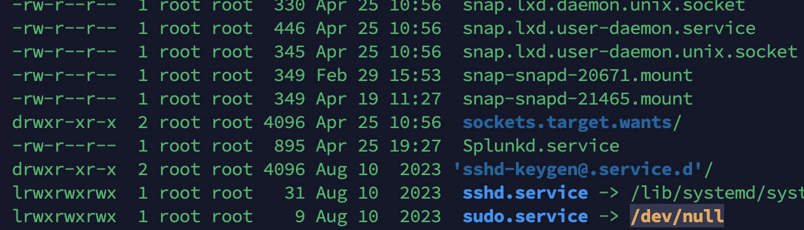

<h1>Task 5 - 1 :Glusterfs</h1>
 
<h2>1- Have at least three nodes</h2>
set ip static
 
<h2>2- Add DNS to all servers</h2>
vim /etc/hosts 
    192.168.33.134  s1 
    192.168.33.135  s2 
    192.168.33.136  s3 

 
<h2>3- Add nameserver for connecting internet:</h2>
ls -l /etc/resolv.conf 
unlink /etc/resolv.conf 
touch /etc/resolv.conf 
vim /etc/resolv.conf 
add: 
nameserver 8.8.8.8 
nameserver 1.1.1.1 
test ping google.com 
if ok go to next: 

 
<h2>4-Updating all system packages</h2>
apt-get update -y
apt-get upgrade -y

 
<h2>5- In main servers </h2>
apt-get install software-properties-common -y 
add-apt-repository ppa:gluster/glusterfs-9 
sudo apt-get update 
sudo apt-get install -y glusterfs-server 

<h2>6- on client server </h2>

install apt  
<h2>7- config </h2> 
systemctl start glusterd
systemctl enable glusterd
systemctl status glusterd

You should see something like this:
     Created symlink /etc/systemd/system/multi-user.target.wants/glusterd.service → /lib/systemd/system/glusterd.service.

     From "server1"
    gluster peer probe s2

    gluster peer probe s3

    From "server2"

    gluster peer probe s1

    Check the peer status on s1:

    gluster peer status

<h2>7- Create a Drive + mount: </h2>
On all servers:  
 mkdir -p  /mnt/gluster
 chmod -R 0755 /mnt/gluster

gluster volume create gv0 replica 3 server1:/data/brick1/gv0 server2:/data/brick1/gv0 server3:/data/brick1/gv0

